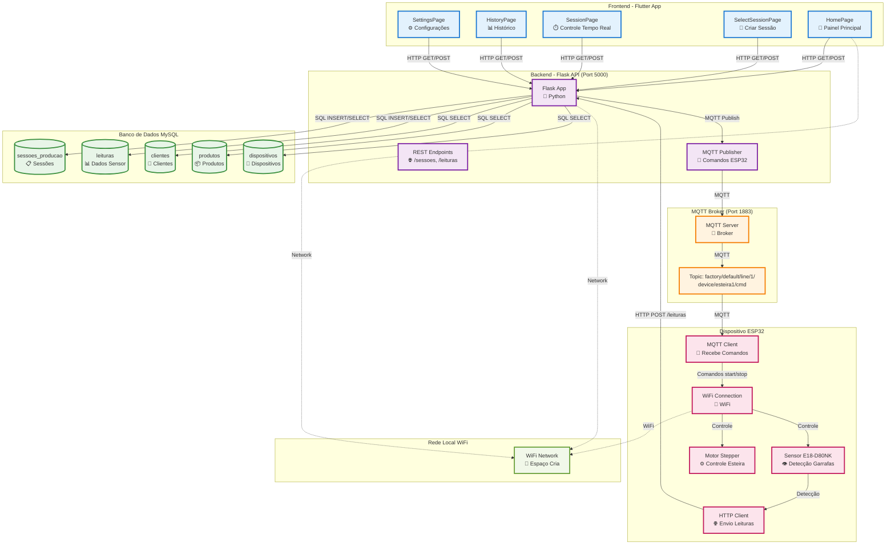
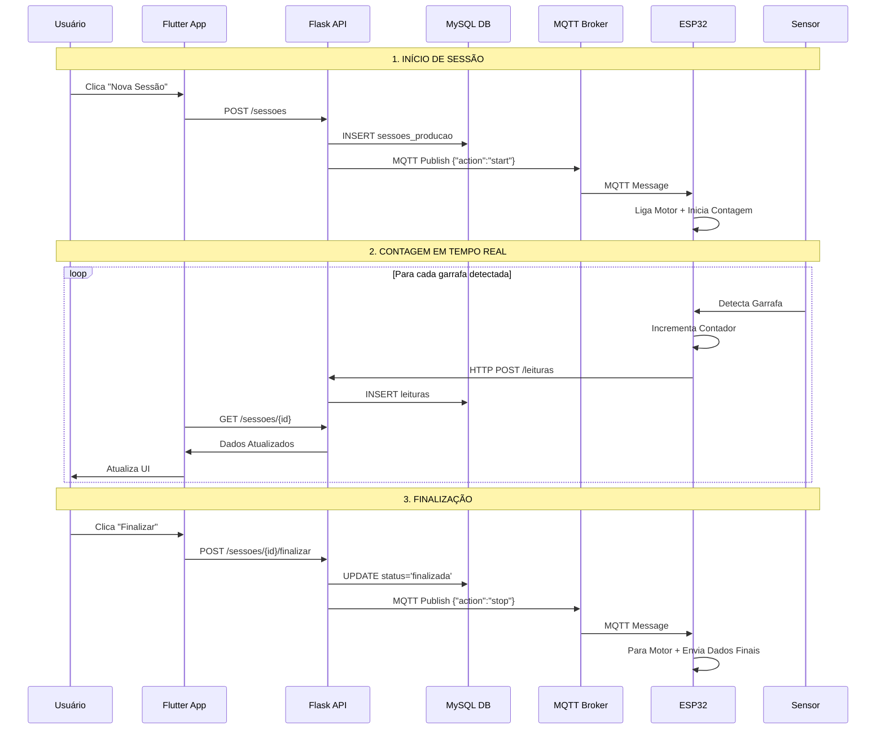
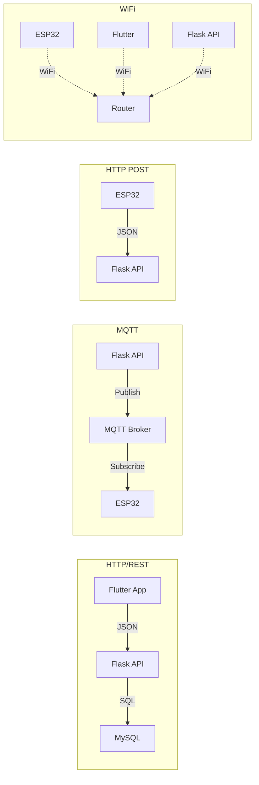
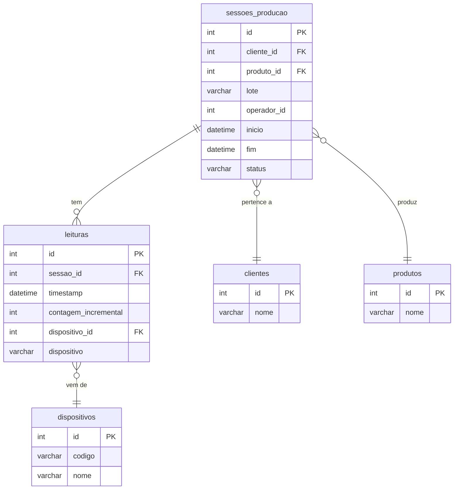

# Diagrama Mermaid da Arquitetura

```mermaid
graph TB
    %% Frontend Flutter
    subgraph "Frontend - Flutter App"
        A[HomePage<br/>📱 Painel Principal]
        B[SelectSessionPage<br/>📝 Criar Sessão]
        C[SessionPage<br/>⏱️ Controle Tempo Real]
        D[HistoryPage<br/>📊 Histórico]
        E[SettingsPage<br/>⚙️ Configurações]
    end

    %% Backend Flask
    subgraph "Backend - Flask API (Port 5000)"
        F[Flask App<br/>🐍 Python]
        G[REST Endpoints<br/>🌐 /sessoes, /leituras]
        H[MQTT Publisher<br/>📡 Comandos ESP32]
    end

    %% Banco de Dados
    subgraph "Banco de Dados MySQL"
        I[(sessoes_producao<br/>📋 Sessões)]
        J[(leituras<br/>📊 Dados Sensor)]
        K[(clientes<br/>👥 Clientes)]
        L[(produtos<br/>📦 Produtos)]
        M[(dispositivos<br/>🔧 Dispositivos)]
    end

    %% MQTT Broker
    subgraph "MQTT Broker (Port 1883)"
        N[MQTT Server<br/>📡 Broker]
        O[Topic: factory/default/line/1/<br/>device/esteira1/cmd]
    end

    %% Dispositivo ESP32
    subgraph "Dispositivo ESP32"
        P[WiFi Connection<br/>📶 WiFi]
        Q[Sensor E18-D80NK<br/>👁️ Detecção Garrafas]
        R[Motor Stepper<br/>⚙️ Controle Esteira]
        S[HTTP Client<br/>🌐 Envio Leituras]
        T[MQTT Client<br/>📡 Recebe Comandos]
    end

    %% Rede
    subgraph "Rede Local WiFi"
        U[WiFi Network<br/>📶 Espaço Cria]
    end

    %% Fluxo HTTP/REST
    A -->|HTTP GET/POST| F
    B -->|HTTP GET/POST| F
    C -->|HTTP GET/POST| F
    D -->|HTTP GET/POST| F
    E -->|HTTP GET/POST| F

    %% Fluxo Database
    F -->|SQL INSERT/SELECT| I
    F -->|SQL INSERT/SELECT| J
    F -->|SQL SELECT| K
    F -->|SQL SELECT| L
    F -->|SQL SELECT| M

    %% Fluxo MQTT
    F -->|MQTT Publish| H
    H -->|MQTT| N
    N -->|MQTT| O
    O -->|MQTT| T

    %% Fluxo ESP32
    T -->|Comandos start/stop| P
    P -->|Controle| Q
    P -->|Controle| R
    Q -->|Detecção| S
    S -->|HTTP POST /leituras| F

    %% Conexões de Rede
    P -.->|WiFi| U
    F -.->|Network| U
    A -.->|Network| U

    %% Estilos
    classDef frontend fill:#e3f2fd,stroke:#1976d2,stroke-width:3px
    classDef backend fill:#f3e5f5,stroke:#7b1fa2,stroke-width:3px
    classDef database fill:#e8f5e8,stroke:#388e3c,stroke-width:3px
    classDef mqtt fill:#fff3e0,stroke:#f57c00,stroke-width:3px
    classDef device fill:#fce4ec,stroke:#c2185b,stroke-width:3px
    classDef network fill:#f1f8e9,stroke:#689f38,stroke-width:3px

    class A,B,C,D,E frontend
    class F,G,H backend
    class I,J,K,L,M database
    class N,O mqtt
    class P,Q,R,S,T device
    class U network
```

## Fluxo Detalhado de Dados

```mermaid
sequenceDiagram
    participant U as Usuário
    participant F as Flutter App
    participant A as Flask API
    participant D as MySQL DB
    participant M as MQTT Broker
    participant E as ESP32
    participant S as Sensor

    Note over U,S: 1. INÍCIO DE SESSÃO
    U->>F: Clica "Nova Sessão"
    F->>A: POST /sessoes
    A->>D: INSERT sessoes_producao
    A->>M: MQTT Publish {"action":"start"}
    M->>E: MQTT Message
    E->>E: Liga Motor + Inicia Contagem

    Note over U,S: 2. CONTAGEM EM TEMPO REAL
    loop Para cada garrafa detectada
        S->>E: Detecta Garrafa
        E->>E: Incrementa Contador
        E->>A: HTTP POST /leituras
        A->>D: INSERT leituras
        F->>A: GET /sessoes/{id}
        A->>F: Dados Atualizados
        F->>U: Atualiza UI
    end

    Note over U,S: 3. FINALIZAÇÃO
    U->>F: Clica "Finalizar"
    F->>A: POST /sessoes/{id}/finalizar
    A->>D: UPDATE status='finalizada'
    A->>M: MQTT Publish {"action":"stop"}
    M->>E: MQTT Message
    E->>E: Para Motor + Envia Dados Finais
```

## Protocolos de Comunicação

```mermaid
graph LR
    subgraph "HTTP/REST"
        A[Flutter App] -->|JSON| B[Flask API]
        B -->|SQL| C[MySQL]
    end
    
    subgraph "MQTT"
        D[Flask API] -->|Publish| E[MQTT Broker]
        E -->|Subscribe| F[ESP32]
    end
    
    subgraph "HTTP POST"
        G[ESP32] -->|JSON| H[Flask API]
    end
    
    subgraph "WiFi"
        I[ESP32] -.->|WiFi| J[Router]
        K[Flutter] -.->|WiFi| J
        L[Flask API] -.->|WiFi| J
    end
```

## Arquitetura de Dados

```mermaid
erDiagram
    sessoes_producao {
        int id PK
        int cliente_id FK
        int produto_id FK
        varchar lote
        int operador_id
        datetime inicio
        datetime fim
        varchar status
    }
    
    leituras {
        int id PK
        int sessao_id FK
        datetime timestamp
        int contagem_incremental
        int dispositivo_id FK
        varchar dispositivo
    }
    
    clientes {
        int id PK
        varchar nome
    }
    
    produtos {
        int id PK
        varchar nome
    }
    
    dispositivos {
        int id PK
        varchar codigo
        varchar nome
    }
    
    sessoes_producao ||--o{ leituras : "tem"
    sessoes_producao }o--|| clientes : "pertence a"
    sessoes_producao }o--|| produtos : "produz"
    leituras }o--|| dispositivos : "vem de"
```
